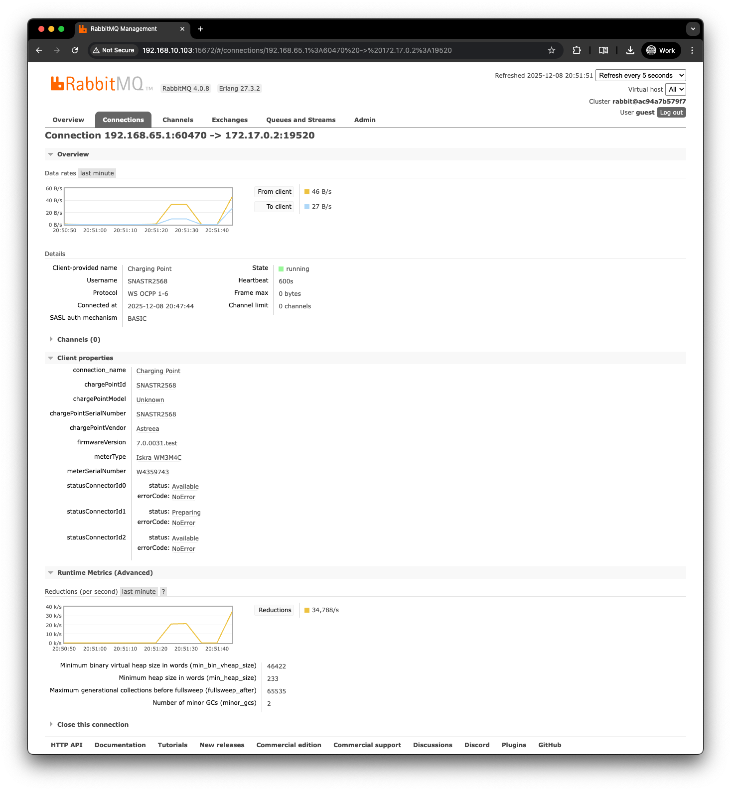

# RabbitMQ Web OCPP plugin

A RabbitMQ plugin that turns the broker into a [highly-scalable](https://www.rabbitmq.com/blog/2023/03/21/native-mqtt#1-million-mqtt-connections), memory-efficient and low-latency gateway for EV charge stations. This plugin provides a native thin translator layer for OCPP-over-WebSockets to RabbitMQ AMQP protocol. Both version `1.6J` and `2.x` should be supported as the base JSON format array was kept backwards compatible, even tho many of the action names and payloads are changed.

## Motivation

Doing research for our CSMS platform, we found [IoT and WebSockets in K8s: Operating and Scaling an EV Charging Station Network - Saadi Myftija](https://www.youtube.com/watch?v=CuiY1Vj-A5E) and [Building an OCPP-compliant electric vehicle charge point operator solution using AWS IoT Core](https://aws.amazon.com/blogs/iot/building-an-ocpp-compliant-electric-vehicle-charge-point-operator-solution-using-aws-iot-core/), both ilustrating a rather complex and costly cloud architecture for this use-case. CPOs frequently need to fan-in **tens of thousands of charge points (CPs)** over the public (LTE) Internet while keeping stateful request/response semantics (RPC), durable command queues and enterprise-grade HA. 
RabbitMQ already excels at message durability and routing, but traditionally the OCPP world still relies on proprietary gateways or heavyweight HTTP stacks.

`rabbitmq_web_ocpp` closes that gap:

* **Zero external proxy** – The native Erlang HTTP server included in RabbitMQ, Cowboy, terminates `wss://` connections on the broker node, allowing even mTLS peer verification.
* **Native AMQP routing** – every OCPP frame is stored as a RabbitMQ *message container*; you fan-out, DLX, or mirror it; OCPP backend can be written in any programming language as queue workers.
* **One Erlang process per charger** – the same footprint as the native MQTT rewrite.
* **Reconnection storms resilience** - handled by RabbitMQ HA cluster, backend scalling is decopled.

## Why “one Erlang process per charger” actually scales

* **Low memory usage per process** – a BEAM process starts with a 256-word heap; even
  with the pending-map and a few binaries a live Web-OCPP handler + channel
  stays < few KiB.
* **No kernel threads** – the BEAM scheduler multiplexes hundreds of
  thousands of lightweight processes onto a fixed pool of OS threads.
  Context switches are micro-seconds and never hit the kernel.
* **Per-process garbage collection** – pauses are micro-scopic and local;
  one slow charger cannot block the others.
* **Built-in crash isolation & supervision** – the classic *let it crash*
  idiom restarts a misbehaving charger process without touching neighbours,
  something a monolithic Java or Go gateway must re-implement.
* **Direct in-VM routing** – by skipping TCP and AMQP frames the path from
  WebSocket frame → queue deliver → WebSocket send is one message copy
  inside the VM—not four kernel crossings like a side-car proxy.


## Installation

This plugin works only with modern versions of RabbitMQ 4.x based on AMQP 1.0.

### Docker image

The quickest way to get started is the prebuilt multi-arch (`amd64`/`arm64`) image, published to GitHub Container Registry on every push to `master`: [`ghcr.io/vampirebyte/rabbitmq-web-ocpp`](https://github.com/vampirebyte/rabbitmq-web-ocpp/pkgs/container/rabbitmq-web-ocpp). It is the official `rabbitmq:<version>-management` image with the plugin baked in and already enabled, so no further setup is required:

``` bash
docker run -it --rm --name rabbitmq-ocpp \
    -p 5672:5672 -p 15672:15672 -p 19520:19520 \
    ghcr.io/vampirebyte/rabbitmq-web-ocpp:4.3.1-ocpp
```

Tags follow the bundled RabbitMQ version (`4.3.1-ocpp`, `4.2.7-ocpp`, ...), plus a `-<short sha>` variant pinning the exact plugin commit.

### Plugin archive (.ez)

You can [build from source](https://www.rabbitmq.com/plugin-development.html) or you can download the latest release build from GitHub. Unzip and place the `rabbitmq_web_ocpp-4.x.x.ez` file into your `/etc/rabbitmq/plugins/` folder.
Like all plugins, it [must be enabled](https://www.rabbitmq.com/plugins.html) before it can be used:

``` bash
# this might require sudo
rabbitmq-plugins enable rabbitmq_web_ocpp
```

Detailed instructions on how to install a plugin into RabbitMQ broker can be found [here](https://www.rabbitmq.com/plugins.html#installing-plugins).

Note that release branches (`v4.1.x` vs. `main`) and target RabbitMQ version need to be taken into account
when building plugins from source.

## How It Works

The communication flow is straightforward: 
1. Connect your EVSE to the following OCPP endpoint: `ws://127.0.0.1:19520/ocpp/%2F/` for `/` (default) vhost running on docker or adjust the URL accordingly.
2. Messages arriving from the EVSE are sent to the configured exchange (default: `amq.topic`) with `correlation_id` set to the OCPP `messageId` and `reply_to` set to the EVSE ID.
3. Configure backend worker routing on the CSMS side by creating a queue bound to the same exchange. Use routing keys in the format: `protocolver.actionname.req/conf/error`. Examples: `ocpp16.BootNotification.req`, `ocpp16.Heartbeat.conf`, `ocpp201.StatusNotification.req`. Common patterns include `ocpp16.#` for all v1.6 traffic or `*.StartTransaction.#` for billing-specific workers. See the [RabbitMQ Topics tutorial](https://www.rabbitmq.com/tutorials/tutorial-five-python#topic-exchange) for details.
4. After processing and validating the message in your async worker, build a valid OCPP Response (or error) and publish it back to the same exchange with the routing key set to the EVSE ID and `correlation_id` set to the original request's OCPP `messageId`. The plugin handles sending this message back to the EVSE via the correct WebSocket connection.
5. Queues can be consumed by multiple identical, stateless workers written in any programming language. Monitor queues using built-in tools (e.g., Grafana) and configure auto-scaling based on message latency or queue depth.
6. If a worker throws an exception before sending a valid OCPP response, standard AMQP ACK/NACK principles apply: unconfirmed messages return to the queue for processing by another worker. Handle failure scenarios (e.g., database outages) gracefully to avoid infinite retry loops.

## Offline Detection

Whenever an established charge point connection terminates — clean WebSocket close, TCP drop, crash or broker shutdown — the plugin publishes one final synthetic `StatusNotification` CALL on behalf of the charge point, so backend workers learn about the disconnect through the same channel as any other OCPP traffic. The payload marks the whole charge point (`connectorId` 0) unavailable, shaped for the protocol version the charge point was connected with:

OCPP 1.x:

```json
[2,"40a2216a-4c22-37f8-28f2-92b7e6ba205e","StatusNotification",{"connectorId":0,"errorCode":"NoError","status":"Unavailable","timestamp":"2026-07-17T13:31:19Z","vendorErrorCode":"Offline","vendorId":"rabbitmq"}]
```

OCPP 2.x:

```json
[2,"83c2c788-712b-18a4-7456-29a4586ddb4a","StatusNotification",{"connectorId":0,"connectorStatus":"Unavailable","customData":{"vendorErrorCode":"Offline","vendorId":"rabbitmq"},"evseId":0,"timestamp":"2026-07-17T13:10:27Z"}]
```

Workers can recognize the synthetic frame by `vendorErrorCode` or `vendorId` — e.g. to skip sending the CALLRESULT, which would otherwise sit in the disconnected charge point's queue until it reconnects and be discarded because of an unknown `messageId`.

Alternatively (or additionally — e.g. to also detect chargers coming *online* - if you don't do this by StatusNotification), enable the [`rabbitmq_event_exchange`](https://www.rabbitmq.com/docs/event-exchange) plugin and bind a queue to the internal `amq.rabbitmq.event` topic exchange for the `connection.created` and `connection.closed` routing keys. Connections handled by this plugin carry a `protocol` header of `{'WS OCPP', ...}` and a `client_id` header with the EVSE ID, so consumers can filter out non-OCPP connections (management UI, shovels, backend workers) and map events back to charge points.

## Documentation

For all configuration options, please refer to the nearly identical plugin, [RabbitMQ Web MQTT guide](https://www.rabbitmq.com/web-mqtt.html).

## Screenshots



## Enterprise-Grade Hosting & SLA Support

For CPOs or platform operators that need to onboard fleets of tens of thousands of chargers, our team offers cloud-native RabbitMQ HA deployments in AWS, Azure or GCP, complete with 24/7 monitoring, incident response, rolling upgrades, and expert assistance for PKI, Prometheus dashboards and OCPP-specific queue policies; we can also deliver custom feature work; we tailor service levels and cluster topologies so you can scale from pilot projects to nationwide networks without re-architecting.

## Copyright and License

(c) 2007-2024 Broadcom. The term “Broadcom” refers to Broadcom Inc. and/or its subsidiaries. All rights reserved.  
(c) 2025 VAMPIRE BYTE SRL. All Rights Reserved.

Released under the same license as RabbitMQ. See [LICENSE](./LICENSE) for details.
